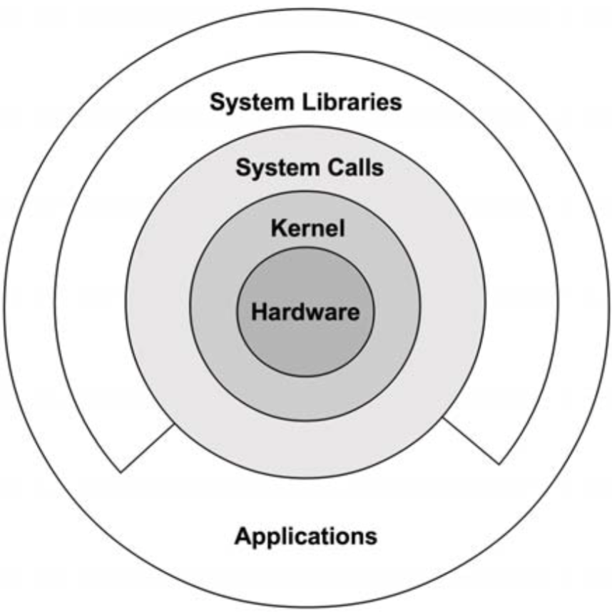
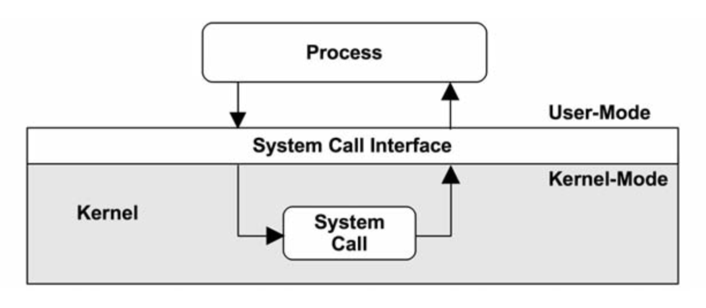
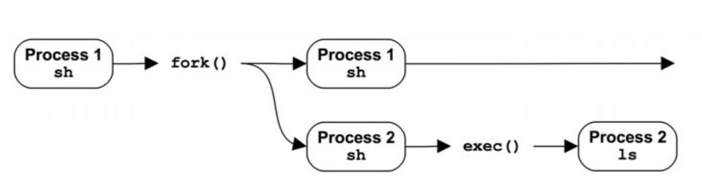
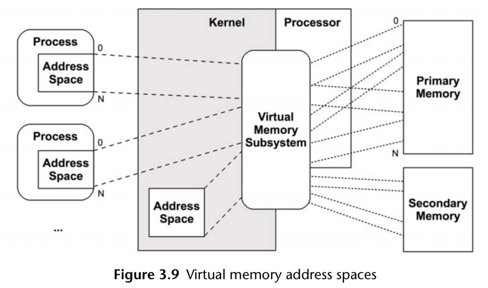
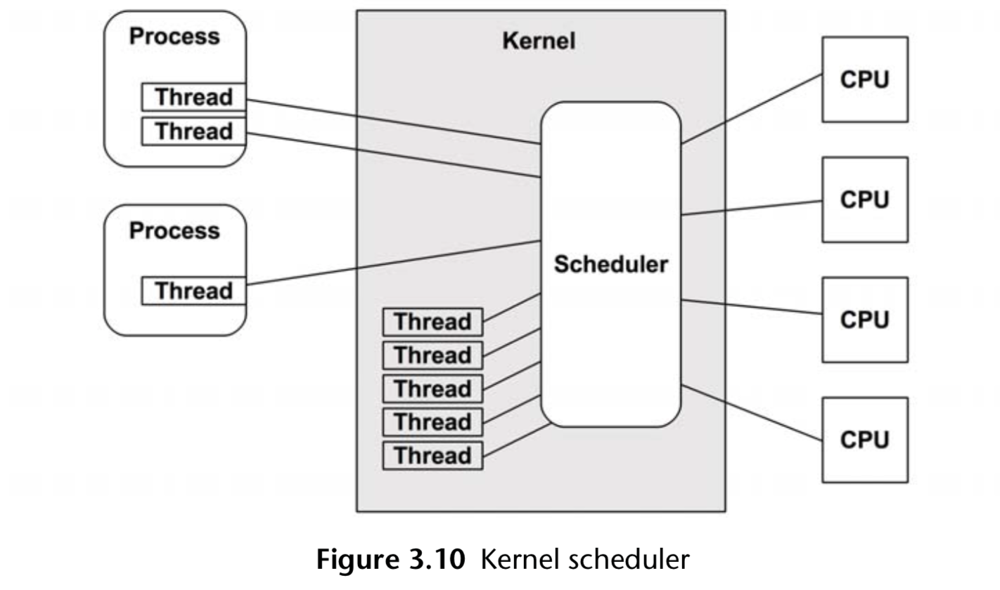
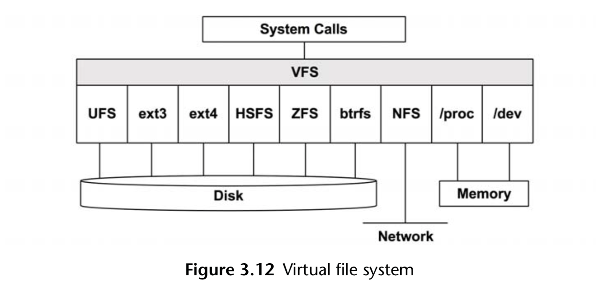
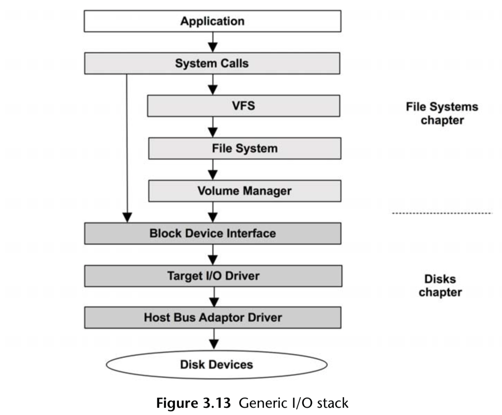

# 内核
  主要管理:CPU调度，内存，文件系统，网络协议以及系统设备。

   
 环上的缺口表示应用程序可以直接进行系统调用

 ## 内核态
   内核是唯一运行在特殊CPU模式的程序，这种特殊的CPU模式叫做内核态，在内核态下，设备的一切访问以及特权的执行都是被允许的。  
   由内核态控制设备的访问，以及支持多任务处理，除非明确允许，否则进程与用户之间的数据无法彼此访问。  
  

# 进程
  进程是用以执行用户级别程序的环境。进程包括: 内存空间地址、文件描述符、线程栈和寄存器。  
  进程可以让内核进行多任务处理，使得在一个系统中可以执行上千个进程。  
  一个进程包含一个或多个线程，操作在进程的地址空间内并且共享着一样的文件描述符。  
  线程是一个可执行的上下文，包括栈、寄存器，以及程序计数器。
  多线程可以让单一进程可以在多个CPU上并发地执行。  

## 进程的创建
  通常情况下进程通过系统调用fork()来创建。fork()用自己的进程号创建一个自身进程的一个复制，然后调用exec()才能开始执行命令。  
  
  系统调用fork()可以用写时拷贝(copy-on-write,COW)的策略来提高性能。添加原有地址空间的引用而非吧所有内容复制一遍。  
  一旦进程修改被引用的内存，就会针对修改创建独立的副本。

# 虚拟内存
  虚拟内存是内存的抽象，如果需要，操作系统可以将虚拟内存在主存和二级存储之间映射。
  

# 调度器
  unix是分时操作系统，通过划分执行时间，让多个进程同时运行，进程在处理器上和CPU时间的调度是通过调度器完成的。
    

# VFS
  虚拟文件系统是一个对文件系统类型做抽象的内核界面  
  

# I/O 栈
  

