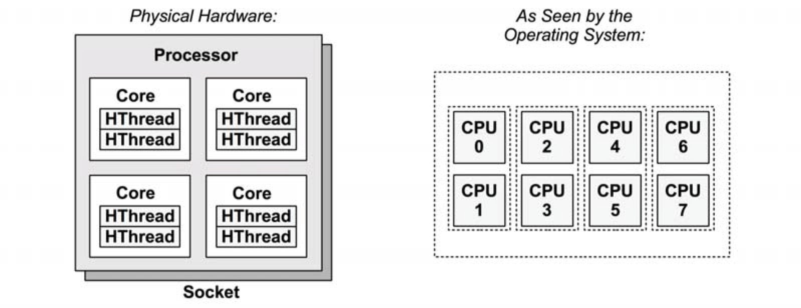
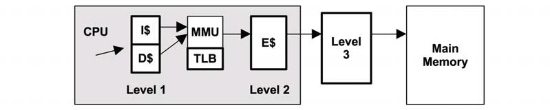

# CPU 架构
下图是单个处理器了 **四个核**和**八个硬件线程**

  

## MMU

  
MMU负责虚拟地址到物理地址的转换，通过芯片上的TLB缓存地址转换。主存(DRAM)里的转换表，处理缓存未命中的情况。

## 调度器
Linux 2.6.23引入完全公平调度器，使用红黑树取代传统运行队列来管理任务，以任务的CPU时间作为key，这样使得CPU的少量消费者相对与CPU消费型负载均衡更容易被找到，提高了交互I/O消费负载的性能。

## 工具
命令|说明|
-|-|
uptime|检查负载均衡，确认CPU负载是随着时间上升还是下降
vmstat|每秒运行vmstat。检查空闲列|
mpstat|检查单个热点CPU|
top/prstat|查看哪个进程用户CPU消耗大|
pidstat/prestat|把CPU消耗大的分解成用户和系统时间|
perf/dtrace/stap/oprofile|从用户时间或者内核时间角度剖析CPU使用堆栈跟踪|
perf/cpustat|测量CPI|


### 命令
#### vmstat
```
[root@A01-R02-I213-59-211TQNM ~]# vmstat 1
procs -----------memory---------- ---swap-- -----io---- -system-- ------cpu-----
 r  b   swpd   free   buff  cache   si   so    bi    bo   in   cs us sy id wa st
 1  0    172 41403296   2620 82406632    0    0    94   112    0    0 10  3 87  0  0
 0  0    172 41402632   2620 82406640    0    0     0   111 34376 49418  1  1 98  0  0
 1  0    172 41403172   2620 82406720    0    0     0     0 33185 48424  1  1 98  0  0
```
- r: 运行队列长度  
- us: 用户态时间  
- sy: 系统态时间
- id: 空闲
- wa: 等待I/O
- st: CPU在虚拟化环境下其他租户的开销

#### mpstat

```
[root@TQNM ~]# mpstat -P ALL 1
Linux 3.10.0-693.5.2.el7.jd_3311.x86_64 05/03/2019 	_x86_64_	(16 CPU)

06:17:00 PM  CPU    %usr   %nice    %sys %iowait    %irq   %soft  %steal  %guest  %gnice   %idle
06:17:01 PM  all    0.89    0.00    1.15    0.00    0.00    0.13    0.00    0.00    0.00   97.83
06:17:01 PM    0    1.03    0.00    1.03    0.00    0.00    1.03    0.00    0.00    0.00   96.91
06:17:01 PM    1    2.02    0.00    2.02    0.00    0.00    0.00    0.00    0.00    0.00   95.96
06:17:01 PM    2    1.02    0.00    1.02    0.00    0.00    1.02    0.00    0.00    0.00   96.94
06:17:01 PM    3    1.02    0.00    1.02    0.00    0.00    0.00    0.00    0.00    0.00   97.96
06:17:01 PM    4    2.04    0.00    2.04    0.00    0.00    0.00    0.00    0.00    0.00   95.92
06:17:01 PM    5    1.03    0.00    1.03    0.00    0.00    0.00    0.00    0.00    0.00   97.94
06:17:01 PM    6    0.00    0.00    2.06    0.00    0.00    0.00    0.00    0.00    0.00   97.94
06:17:01 PM    7    1.03    0.00    1.03    0.00    0.00    0.00    0.00    0.00    0.00   97.94
06:17:01 PM    8    0.00    0.00    0.00    0.00    0.00    0.00    0.00    0.00    0.00  100.00
06:17:01 PM    9    0.00    0.00    1.02    0.00    0.00    0.00    0.00    0.00    0.00   98.98
06:17:01 PM   10    1.00    0.00    1.00    0.00    0.00    0.00    0.00    0.00    0.00   98.00
06:17:01 PM   11    0.00    0.00    1.01    0.00    0.00    0.00    0.00    0.00    0.00   98.99
06:17:01 PM   12    1.00    0.00    2.00    0.00    0.00    0.00    0.00    0.00    0.00   97.00
06:17:01 PM   13    0.00    0.00    1.02    0.00    0.00    0.00    0.00    0.00    0.00   98.98
06:17:01 PM   14    1.03    0.00    1.03    0.00    0.00    0.00    0.00    0.00    0.00   97.94
06:17:01 PM   15    1.01    0.00    0.00    0.00    0.00    0.00    0.00    0.00    0.00   98.99

```

- CPU: 逻辑CPU ID
- %usr: 用户态时间
- %nice: 以nice优先级的进程用户态时间
- %sys: 系统态时间
- %iowait: I/O等待
- %irq: 硬件中断CPU用量
- %soft: 软件终端CPU用量
- %steal: 耗费在服务器其他租户的时间
- %idle: 空闲


#### pidstat
```
[root@TQNM ~]# pidstat 1
Linux 3.10.0-693.5.2.el7.jd_3311.x86_64	05/03/2019 	_x86_64_	(16 CPU)

06:25:16 PM   UID       PID    %usr %system  %guest    %CPU   CPU  Command
06:25:17 PM     0       687    0.98    0.00    0.00    0.98     4  rsyslogd
06:25:17 PM   596     69391    0.98    0.00    0.00    0.98     5  kube-scheduler
06:25:17 PM     0    258986    0.00   11.76    0.00   11.76     4  java
```

#### time ptime
```
$ /usr/bin/time -v cp fileA fileB
    Command being timed: "cp fileA fileB"
    User time (seconds): 0.00
    System time (seconds): 0.26
    Percent of CPU this job got: 24%
    Elapsed (wall clock) time (h:mm:ss or m:ss): 0:01.08
    Average shared text size (kbytes): 0
    Average unshared data size (kbytes): 0
    Average stack size (kbytes): 0
    Average total size (kbytes): 0
    Maximum resident set size (kbytes): 3792
    Average resident set size (kbytes): 0
    Major (requiring I/O) page faults: 0
    Minor (reclaiming a frame) page faults: 294
    Voluntary context switches: 1082
    Involuntary context switches: 1
    Swaps: 0
    File system inputs: 275432
    File system outputs: 275432
    Socket messages sent: 0
    Socket messages received: 0
    Signals delivered: 0
    Page size (bytes): 4096
    Exit status: 0
```
> time -v 一般不在shell提供
